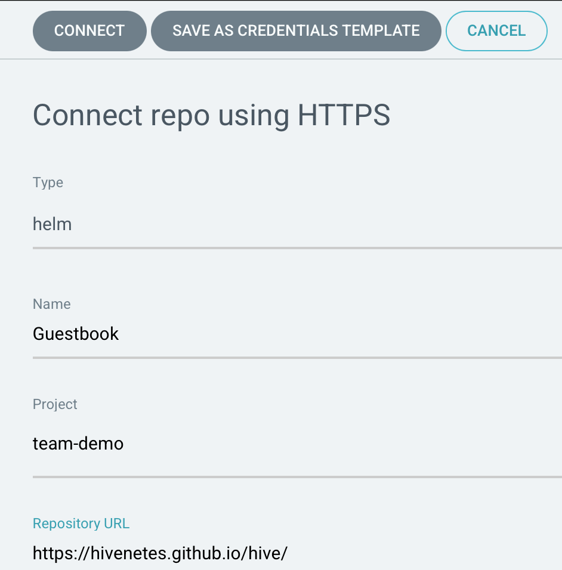
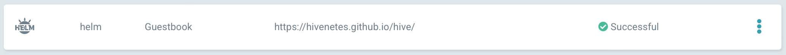
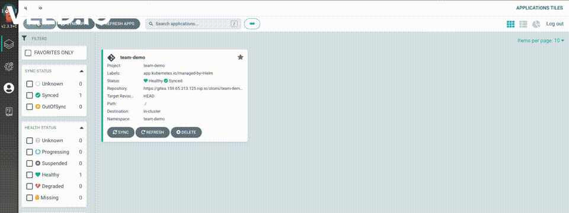

# Lab 9: Github CI + Otomi workflow

Most of the developers/companies have an existing Github CI pipeline and don't want to make drastic changes to their existing workflows. In this lab, we will demonstrate how one can easily integrate an existing GitHub CI workflow with Otomi, which is pre-baked with Argo CD and Loki Grafana. 

 - We will use a sample [repository](https://github.com/hivenetes/hive) that has been configured to release a helm chart for a [three-tier microservice application](https://cloud.google.com/kubernetes-engine/docs/tutorials/guestbook) using [helm/chart-releaser-action](https://github.com/helm/chart-releaser-action)
 - Connect the chart repo from Otomi(using Argo CD)
 - Register the frontend service from the Otomi console
 - Monitor the deployed microservice application using Loki Grafana

**Pre-requisites**
 - You have already created a team in Otomi, Ex: `team-demo`

## Instructions

### 1. Activate Argo CD and Loki Grafana

- Go to `Apps` under the `Platform` section in the side menu
- Drag and Drop `Argo CD` from the `Disabled apps` to the `Enabled apps`
- Drag and Drop `Loki` from the `Disabled apps` to the `Enabled apps` and `Deploy Changes`

### 2. Connect GitHub repository in Argo CD

- On the left pane, Team-demo ->  Apps -> Open `Argo CD`
- Select the `Manage your repositories, projects, settings`
- Select `Repositories` -> `CONNECT REPO USING HTTPS`
- Fill in the form as shown below and click "Connect"

    

    *Repository URL:* `https://hivenetes.github.io/hive/`
- Upon successful connection, you should see something like this

    

### 3. Create an App on Argo CD

- Create an App by following the screencast

    

### 4. Register the `frontend` service in Otomi

Head back to the console to register the `frontend` service of the three-tier microservice application

- Go to `Services` -> `Create Service`
- Fill in `frontend` as the name of the service
- Select `Existing Kubernetes service`
- Under `Exposure` select `Ingress`
- Click `submit` & Deploy Changes
- Once the drone pipeline is successful, you will be able to access the `frontend` service from the URL in the Services window

You should be able to see the famous `guestbook` application.

### 5. Monitoring the app using Loki Grafana

Now that we have deployed our `guestbook` application. 
We can now use Loki Grafana which is integrated into Otomi to check the application logs and monitor the performance of the services deployed. 

- Follow the screencast below

    

> **_TAKEAWAY:_** Otomi offers a seamless integration with your existing git workflow using the pre-baked open source tools 