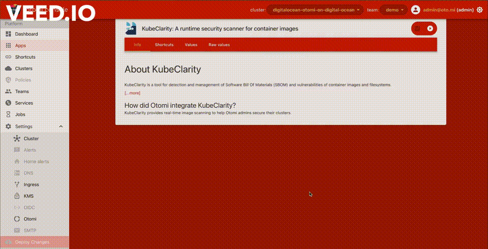

# Lab 10: Runtime Container Security using KubeClarity

[KubeClarity](https://github.com/openclarity/kubeclarity) by Cisco’s OpenClarity is one of the next generations of security scanning tools that allows you to perform fine-grained security scans of your K8s runtime as well as container images scanning and pre-deploy CI/CD scanning capability. In this lab, we will demonstrate how one can
seamlessly use KubeClarity to perform runtime container security scans from Otomi. 

 - We will activate the KubeClarity application from the Otomi console
 - Perform a runtime scan of the `team-demo` namespace
 - Check out the vulnerability scan report

**Pre-requisites**
 - You have already created a team in Otomi, Ex: `team-demo`
 - Have the `guestbook` application deployed by following the [previous](../09-github-ci-workflow/README.md) lab

## Instructions

### 1. Activate KubeClarity

- Go to `Apps` under the `Platform` section in the side menu
- Drag and Drop `KubeClarity` from the `Disabled apps` to the `Enabled apps` and `Deploy Changes`

### 2. Perform runtime scan of the `team-demo` namespace

- On the left pane, Team-demo ->  Apps -> Open `KubeClarity`
- Select the `Runtime Scan` on the left pane
- `SELECT THE TARGET NAMESPACES TO SCAN`: *team-demo*  and click `START SCAN`
-  Follow the screencast to see how to perform the scan and check out the vulnerability reports

    

Check out the [KubeClarity Security Scanning](https://redkubes.com/kubeclarity-sec-scanning/) article for more details.

> **_TAKEAWAY:_** Otomi's KubeClarity integration empowers developers and organizations to build secure applications without much hassle