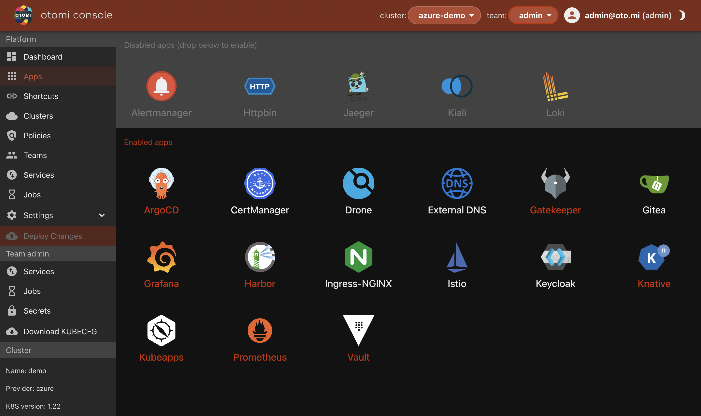

# Otomi: Self-hosted PaaS for Kubernetes

[Otomi](https://otomi.io/) is an open source self-hosted PaaS for Kubernetes and connects many of the technologies found in the CNCF landscape in a single installable package to provide direct value to developers.

Otomi:

- Brings a full PaaS (like Heroku) to your own Kubernetes cluster. The only thing you'll need to do yourself is deploy your application and Otomi will do the rest.

- Allows you to use a PaaS on top of K8s without the constraints and abstractions of traditional PaaS offerings like OpenShift, Cloud Foundry and Heroku.

- Removes the burden of building and maintaining your internal (developer) platform, lowers the burden on operations, and empowers developers to focus on application deployment and management only.

## About the workshop

The workshop aims to demonstrate different use cases and features of [Otomi](https://github.com/redkubes/otomi-core) though hands-on labs.

## For who is the workshop?

- Developers
- Solutions Architects
- DevOps Engineers
- SREs
- Infrastructure & Cloud Engineers
- Product Managers

## 🎊 Learning objectives

The main objective is to get a good understanding/overview of Otomi and be able to identify the benefits and possible use cases for it.

## 🛠 Lab prerequisites

- Follow the [quickstart](https://github.com/redkubes/otomi-core) to setup a K8s cluster with Otomi installed

In case of not using Azure Cloud shell, install

- [helm](https://helm.sh/docs/intro/install/)
- [az cli](https://docs.microsoft.com/en-us/cli/azure/install-azure-cli)
- [kubectl](https://kubernetes.io/docs/tasks/tools/)
- Optionally: [K9s](https://kubernetes.io/docs/tasks/tools/)

## 🚀 Labs

The workshop is organized into 6 labs:

- Lab 1: [Creating Teams in Otomi](labs/1_create_team/README.md)
- Lab 2: [Configuring network policies in Otomi](labs/2_netpols/README.md)
- Lab 3: [Activate apps in Otomi](labs/3_activate_apps/README.md)
- Lab 4: [Using Knative in Otomi](labs/4_knative/README.md)

After completing the labs, you'll be able to:

- Use the Teams feature in Otomi for multi-tenancy and network isolation
- Use te Otomi web UI to expose K8s services and configure network policies between workloads
- Explain the difference between Otomi core apps and how to activate optional apps
- Create Knative workloads using the Otomi web UI

## 📖 Documentation & support

Official Otomi documentation is available [here](https://otomi.io). We'd also like to invite you to [join our Slack community](https://otomi.slack.com/join/shared_invite/zt-12h11e8aa-6po4NWhhpMXxT~nffDsYqA#/shared-invite/email) for additional support, feature discussions, or just for a quick chat.

The Otomi open source project can be found [here](https://github.com/redkubes/otomi-core) on GitHub. Don't forget to ⭐️ ⭐️ ⭐️.

Thank you!
